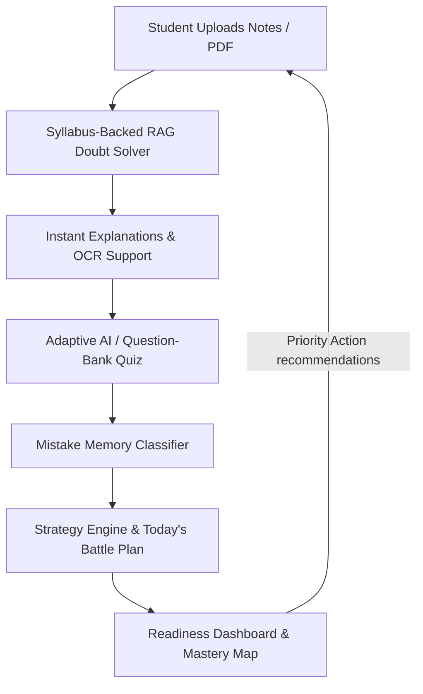

# 🎯 PrepPulse AI — Agentic Study GPS for JEE/NEET Aspirants

PrepPulse AI is an advanced, full-stack learning platform designed specifically for Indian JEE/NEET aspirants. Built around a strategic **Study GPS** philosophy, it translates raw study hours into a structured, data-driven preparation workflow using real syllabus metrics.

---

## 🔄 The Continuous Study Cycle

Instead of simple static practice, PrepPulse AI creates a continuous loop that detects, targets, and resolves student weaknesses:



1. **Doubt**: A student asks a doubt, pastes OCR questions, or uploads question images.
2. **Explanation**: The RAG Doubt Solver retrieves context from uploaded notes, highlighting formulas and common traps.
3. **Quiz**: The system generates an adaptive quiz for the specific chapter using official syllabus chapters.
4. **Mistake Detection**: Incorrect submissions are classified into error types (*Conceptual*, *Formula*, *Careless*, *Wrong Approach*).
5. **Revision**: Mistakes populate a persistent **Mistake Memory** database.
6. **Battle Plan**: The strategy engine schedules prioritized learning and revision tasks for the day.
7. **Readiness Score**: A dynamic score is calculated based on coverage, accuracy, and mistake patterns.

---

## 🛠️ Technology Stack

*   **Frontend**: React, Vite, Tailwind CSS, React Router, Axios, Recharts, Framer Motion
*   **Backend**: Node.js, Express.js, MongoDB, Mongoose, JWT authentication, Multer, `pdf-parse` (for PDF text extraction)
*   **AI Providers**: Groq (Llama models), HuggingFace Inference API (Mistral models), Ollama (Local models), and deterministic fallback mock mode (for offline/demo usage)

---

## 🤖 AI Agents & Strategy Engine

PrepPulse AI incorporates sophisticated backend intelligence:

*   **Syllabus Intelligence Layer** ([`syllabusIntelligence.js`](file:///c:/preppulse_ai_project/study-mate-backend/data/syllabusIntelligence.js)): Integrates PYQ frequency, NCERT priority, expected marks, and revision cycles for JEE and NEET chapters.
*   **Strategy Engine** ([`strategyEngine.js`](file:///c:/preppulse_ai_project/study-mate-backend/services/strategyEngine.js)): Computes readiness scores, syllabus coverage, and prioritizes chapters using a weighted action score algorithm.
*   **Safe Research Agent** (`research_agent.js` concept / AI fallback): Summarizes verified topics using NCERT and NTA official links.
*   **Mistake Memory Classifier**: Uses LLM classifications to group errors and tag weak chapters in the database.
*   **YouTube Transcript Companion**: Retrieves video captions, extracts key terms and formulas, and constructs targeted checkup questions.

---

## 📁 Repository Structure

```text
preppulse_ai_project/
├── study-mate/                 # Frontend React application
│   ├── src/
│   │   ├── components/         # Nav, Sidebar, Resource/Quiz Modals
│   │   ├── pages/              # Onboarding, Dashboard, Chatbot, YouTube, Quiz, Heatmap
│   │   └── api/                # Axios service wrapper
│   └── package.json
├── study-mate-backend/         # Backend Node/Express API
│   ├── config/                 # DB & AI configurations
│   ├── controllers/            # API Controllers (Auth, Doubt, Quiz, Strategy)
│   ├── data/                   # Syllabus list & Question Bank fallbacks
│   ├── models/                 # Mongoose schemas (User, MistakeLog, QuizAttempt, Mastery)
│   ├── services/               # aiService, strategyEngine, ragService, chunkingService
│   └── package.json
├── README.md                   # Main Project Guide
└── test_document.pdf           # Sample PDF for testing resource upload
```

---

## ⚡ Setup & Installation

### 1. Prerequisites
Ensure you have the following installed:
*   [Node.js 18+](https://nodejs.org/)
*   [MongoDB](https://www.mongodb.com/) (running locally or a remote MongoDB Atlas URI)

### 2. Backend Setup
Navigate to the backend folder, install npm packages, create your `.env` file, and start the development server:

```bash
# Go to backend
cd study-mate-backend

# Install packages
npm install

# Copy configuration template
copy .env.example .env

# Run development server (runs on port 5000)
npm run dev
```
By default, the backend API will run on **`http://localhost:5000/api`**.

### 3. Frontend Setup
Open a new terminal window, navigate to the frontend folder, install dependencies, copy environment configs, and run the Vite server:

```bash
# Go to frontend
cd study-mate

# Install packages
npm install

# Copy environment configurations
copy .env.example .env

# Run Vite server (runs on port 5173)
npm run dev
```
Open **[http://localhost:5173](http://localhost:5173)** in your browser.

---

## ⚙️ Environment Variables

### Backend Configuration (`study-mate-backend/.env`)
```env
PORT=5000
NODE_ENV=development
MONGO_URI=mongodb://127.0.0.1:27017/preppulse_ai
JWT_SECRET=replace_with_a_long_random_secret
JWT_EXPIRES_IN=7d
FRONTEND_URL=http://localhost:5173

# AI Provider Configuration: fallback, groq, huggingface, or ollama
# 'fallback' requires no keys and outputs high-quality deterministic mock responses
AI_PROVIDER=fallback

# Cloud Provider Keys (Optional)
GROQ_API_KEY=your-groq-key
GROQ_MODEL=llama-3.1-8b-instant

HF_API_TOKEN=your-hf-token
HF_MODEL=mistralai/Mistral-7B-Instruct-v0.3

# Local Ollama (Optional)
OLLAMA_BASE_URL=http://localhost:11434
OLLAMA_MODEL=qwen2.5:7b
EMBEDDING_MODEL=BAAI/bge-small-en-v1.5
```

---

## 🚀 Recommended Demo Walkthrough

1. **Register & Log In**: Go to the login screen and create a new account.
2. **Onboard**: Select your exam category (JEE or NEET) and study hours in your Profile.
3. **Upload Notes**: Go to the **Upload Notes** page and upload a study material (like a PDF or [test_document.pdf](file:///c:/preppulse_ai_project/test_document.pdf)). Select the corresponding syllabus subject and chapter.
4. **Ask a Doubt**: Type a doubt in the **AI Doubt Solver** tab. The system will retrieve relevant chunks from your uploaded note and give a structured explanation with standard traps.
5. **Take an Adaptive Quiz**: Choose your target chapter using the syllabus dropdowns. Generate and submit a quiz, intentionally answering a couple of questions incorrectly.
6. **Check Mistake Memory**: View the **Mistake Memory** page to verify that the mistake classification model successfully categorized your errors.
7. **Verify today's Battle Plan**: Open **Study Plan** to review the revision tasks curated by the strategy engine.
8. **View Analytics**: Navigate to the dashboard to monitor your overall readiness percentage, weak concepts heatmap, and priority chapter mapping.
